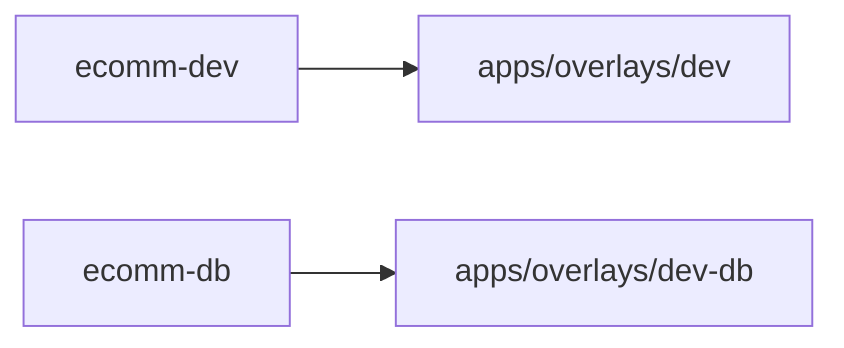

# Ecomm CDC on CRC: Architecture and Troubleshooting

This document captures the current architecture, GitOps layout, Jenkins automation, and the most common troubleshooting steps we used while stabilizing the pipeline on CRC.

Date last updated: 2026-02-05

## Quick Start

Fastest path to run everything (Jenkins):
1. Open the Jenkins pipeline.
2. Set:
   - `RUN_ALL=true`
   - `SKIP_BUILD=true`
3. Build with parameters.

Fastest path to verify via CLI:
```
oc -n db get jobs -l argocd.argoproj.io/instance=ecomm-db -o wide
oc -n ecomm-streaming get kafkaconnector ecomm-outbox \
  -o jsonpath='{range .status.conditions[*]}{.type}{" "}{.status}{" "}{.message}{"\n"}{end}'
oc -n ecomm-streaming exec ecomm-kafka-ecomm-kafka-pool-0 -- \
  /opt/kafka/bin/kafka-topics.sh \
  --bootstrap-server ecomm-kafka-kafka-bootstrap.ecomm-streaming.svc.cluster.local:9092 \
  --list | sort | grep '^ecomm\.'
```

## Architecture Diagram

```mermaid
flowchart LR
  subgraph CRC[OpenShift Local (CRC)]
    subgraph gitops[openshift-gitops]
      ArgoCD[Argo CD]
    end
    subgraph cicd[cicd]
      Jenkins[Jenkins]
    end
    subgraph dbns[db]
      Postgres[(PostgreSQL HA)]
      Outbox[Outbox tables]
    end
    subgraph apps[ecomm]
      Cart[cart-service]
      Catalog[catalog-service]
      Orders[orders-service]
      Payment[payment-service]
      Shipping[shipping-service]
    end
    subgraph streaming[ecomm-streaming]
      Kafka[(Kafka)]
      Connect[Kafka Connect]
      Debezium[Debezium Outbox Connector]
    end
  end

  Jenkins -->|push GitOps| ArgoCD
  ArgoCD -->|sync manifests| apps
  ArgoCD -->|sync DB jobs| dbns
  Cart -->|write outbox| Outbox
  Catalog -->|write outbox| Outbox
  Orders -->|write outbox| Outbox
  Payment -->|write outbox| Outbox
  Shipping -->|write outbox| Outbox
  Outbox --> Debezium --> Kafka
```

## Architecture Overview

Components and namespaces:
- OpenShift Local (CRC) single-node cluster
- `openshift-gitops` namespace
- Argo CD (OpenShift GitOps operator)
- `cicd` namespace
- Jenkins (pipeline runner)
- `ecomm` namespace
- App services (cart, catalog, orders, payment, shipping)
- `db` namespace
- PostgreSQL HA (Patroni/Crunchy)
- `ecomm-streaming` namespace
- Strimzi Kafka + Kafka Connect
- Debezium Outbox connector

High-level data flow:
1. App outbox tables are written in PostgreSQL.
2. Debezium Postgres connector reads outbox tables.
3. Event Router SMT routes events to topic names derived from `aggregate_type`.
4. Topics appear in Kafka and can be consumed by downstream consumers.

## GitOps Layout

Main GitOps repo:
- `/Users/printeshpatel/Downloads/ecomm-cdc-gitops`

Argo CD Applications:
- `argocd/10-app-ecomm-dev.yaml`
  - Source: `apps/overlays/dev`
  - Manages app services, routes, connector
- `argocd/11-app-ecomm-db.yaml`
  - Source: `apps/overlays/dev-db`
  - Manages DB jobs and test SQL configmap

Overlays:
- `apps/overlays/dev`
  - App services and connector
  - No DB jobs (moved to dev-db)
- `apps/overlays/dev-db`
  - `outbox-db-init` Job
  - `outbox-smoke-test` Job
  - `outbox-test-sql` ConfigMap

GitOps application split:


## Jenkins Pipeline

Jenkins repo:
- `/Users/printeshpatel/Downloads/ecomm-cdc-microservices`

Pipeline parameters (Jenkinsfile):
- `RUN_ALL` runs DB init, connector restart, smoke test, and topic verification
- `SKIP_BUILD` skips image builds
- `RUN_DB_INIT` reruns the DB init job
- `RESTART_CONNECTOR` bumps the Strimzi restart annotation
- `RUN_SMOKE_TEST` reruns outbox smoke test
- `VERIFY_TOPICS` checks Kafka topics
- `TOPIC_PREFIX` default `ecomm`

Pipeline behavior:
- Updates GitOps repo files to trigger Argo sync
- Deletes existing DB jobs before rerun to avoid immutable field errors
- Uses RFC3339 timestamp for `strimzi.io/restart`

## Outbox and Debezium Configuration

Outbox tables:
- `cart.outbox_event`
- `catalog.outbox_event`
- `orders.outbox_event`
- `payment.outbox_event`
- `shipping.outbox_event`

Connector config:
- Publication autocreate disabled
- Publication created by DB init job
- Outbox SMT enabled
- Topic names are derived from `aggregate_type`

Expected topics after smoke test:
- `ecomm.cart.CartCheckedOut.v1`
- `ecomm.orders.OrderCreated.v1`
- `ecomm.orders.OrderPaid.v1`
- `ecomm.payment.PaymentAuthorized.v1`
- `ecomm.payment.PaymentFailed.v1`
- `ecomm.shipping.ShipmentCreated.v1`
- `ecomm.public.orders` may also appear from base CDC config

## Sync Order

DB app `ecomm-db` sync waves:
- `outbox-db-init` Job: `sync-wave: -2`
- `outbox-smoke-test` Job: `sync-wave: 0`

App app `ecomm-dev`:
- Connector sync-wave: `-1`

Order of execution:
1. DB init job
2. Connector apply/restart
3. Smoke test job

## Common Issues and Fixes

### Argo UI shows no jobs
Cause:
- Jobs are in namespace `db` and were previously hook resources or filtered out

Fix:
- Use `ecomm-db` app in Argo UI
- Switch to List view
- Filter Namespace to `db`

CLI validation:
```
oc -n db get jobs -l argocd.argoproj.io/instance=ecomm-db -o wide
```

### Argo UI “permission denied” or “Failed to load data”
Cause:
- Argo RBAC default policy set to empty

Fix (CR-managed RBAC):
```
oc -n openshift-gitops patch argocd openshift-gitops --type merge -p '{"spec":{"rbac":{"defaultPolicy":"role:admin","policy":"g, system:cluster-admins, role:admin\ng, cluster-admins, role:admin\ng, kubeadmin, role:admin\ng, system:authenticated, role:admin\n","scopes":"[groups]"}}}'
oc -n openshift-gitops rollout restart deployment/openshift-gitops-server
oc -n openshift-gitops rollout restart deployment/openshift-gitops-dex-server
```

### Kustomize build error “file is not in or below”
Cause:
- `dev-db` overlay referenced files outside its directory

Fix:
- Copy job and configmap files into `apps/overlays/dev-db`
- Keep `dev-db/kustomization.yaml` self-contained

### Job cannot be reapplied, immutable template error
Cause:
- Kubernetes Jobs are immutable once created

Fix:
- Delete job and pods before reapplying
- Pipeline now deletes jobs before rerun

### Job failed to mount DB secret
Cause:
- Used wrong secret name (`pg-ha-pguser-postgres`)

Fix:
- Use `pg-ha-pguser-pg-ha` in job env

### Debezium connector NotReady, publication errors
Cause:
- Connector tried to autocreate publication without table ownership

Fix:
- Set `publication.autocreate.mode: disabled`
- Use DB init job to create publication
- Ensure DB user owns schemas/tables or has required privileges

### Debezium SMT timestamp error
Error:
- `Field 'created_at' is not of type INT64`

Fix:
- Remove `transforms.outbox.table.field.event.timestamp` mapping

### ImagePullBackOff for app pods
Cause:
- Private GHCR images or missing credentials

Fix:
- Use OpenShift internal registry
- Or create registry pull secret and attach to service account

## Operational Commands

Argo app status:
```
oc -n openshift-gitops get applications.argoproj.io
```

Force Argo refresh:
```
oc -n openshift-gitops annotate application ecomm-db argocd.argoproj.io/refresh=hard --overwrite
```

Force Argo sync to latest revision:
```
SHA=$(git -C /Users/printeshpatel/Downloads/ecomm-cdc-gitops rev-parse HEAD)
oc -n openshift-gitops patch application ecomm-db --type merge -p "{\"operation\":{\"sync\":{\"revision\":\"$SHA\",\"prune\":true}}}"
```

Kafka topics check:
```
oc -n ecomm-streaming exec ecomm-kafka-ecomm-kafka-pool-0 -- \
  /opt/kafka/bin/kafka-topics.sh \
  --bootstrap-server ecomm-kafka-kafka-bootstrap.ecomm-streaming.svc.cluster.local:9092 \
  --list | sort | grep '^ecomm\.'
```

Connector health:
```
oc -n ecomm-streaming get kafkaconnector ecomm-outbox \
  -o jsonpath='{range .status.conditions[*]}{.type}{" "}{.status}{" "}{.message}{"\n"}{end}'
```

DB smoke test logs:
```
oc -n db logs job/outbox-smoke-test
```

## Rerun Sequence

Recommended Jenkins run:
- `RUN_ALL=true`
- `SKIP_BUILD=true`

Or manual sequence:
1. Delete jobs if needed
2. Bump `run_id` in GitOps jobs
3. Push GitOps repo
4. Argo auto-sync
5. Verify topics and connector status

## Notes

The Argo UI route is:
```
https://openshift-gitops-server-openshift-gitops.apps-crc.testing
```

Use the `ecomm-db` app to view Jobs in namespace `db`.
